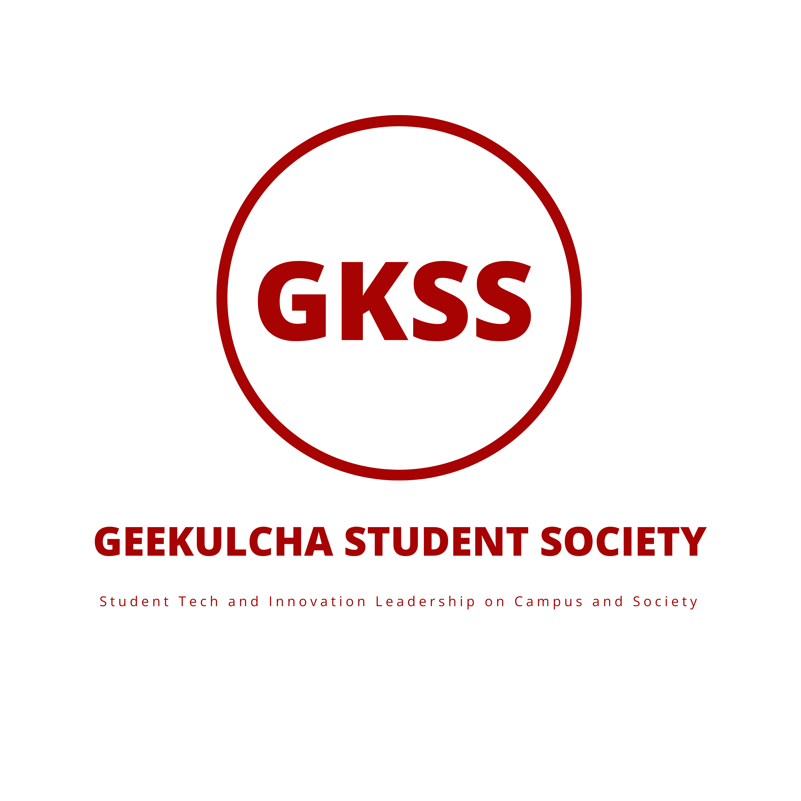

# GKSS | UNISA 🚀

  
  

    We are a chapter of the Geekulcha Student Society ([GKSS](https://geekulcha.dev/gkss)) program which is the part of the [Geekulcha](https://geekulcha.dev)
    organisation that brings closer the developer community & leadership skills to students in universities. 🎓
  

## About Us 👥

The GKSS UNISA chapter is dedicated to fostering a vibrant community of student developers at the University of South Africa. Our mission is to bridge the gap between academic learning and practical software development while creating meaningful connections within the tech community.

## Our Goals for 2024 🎯

- Build a strong community of UNISA student developers
- Create and contribute to open source projects
- Enhance our programming skills in C++ and Python
- Develop practical solutions for UNISA students
- Foster collaboration and knowledge sharing

## GKSS-UNISA on GitHub 💻

We are excited and cannot wait to make an impact! That however, only makes sense if we have an active developer community that **actually** develops. That's where you come in.
We'd love to have an open source community for our chapter, where fellow UNISA students will be the main contributors and inventors of all kinds of crazy software that we will
use to up the efficiency of our studies & everyday lives as open distance e-learning students.

## Focus Areas 🎯

As UNISA students, we're particularly interested in strengthening our skills in the core programming languages taught in our curriculum. While these are our main focus areas, we're not limited to them and welcome projects in any programming language:

  
  

    Building automation tools, data analysis projects, and web applications
  

  
  

    Developing system-level applications, algorithms, and performance-critical software
  

> 💡
  Feel free to bring your expertise in other languages and technologies - we believe in learning from each other and exploring new possibilities!
  s

## Open Source Aspirations 🌟

We believe in the power of open source software and its ability to:
- Create learning opportunities for all
- Build a portfolio of real-world projects
- Contribute to the global developer community
- Develop practical solutions for UNISA students
- Foster collaboration and knowledge sharing

## Contributing 🤝

Each repository in our organization comes with its own set of contribution guidelines! 📚

When you find a project you'd like to contribute to:
1. Check out the `CONTRIBUTING.md` file in that repository
2. Follow the project-specific setup instructions
3. Review the coding standards and best practices
4. Join our discussions in the Issues and Pull Requests sections

We believe in making the contribution process as smooth as possible, so each project's guidelines are tailored to its specific needs and requirements. Whether you're fixing a bug, adding a feature, or improving documentation, we're excited to have you on board! 🎉

## Get Involved! 🚀

Whether you're a beginner or an experienced developer, there's a place for you in our community. Join us in:
- Building exciting projects
- Learning new technologies
- Contributing to open source
- Networking with fellow developers
- Making a real impact in the UNISA community
